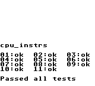
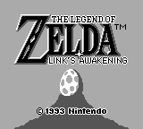
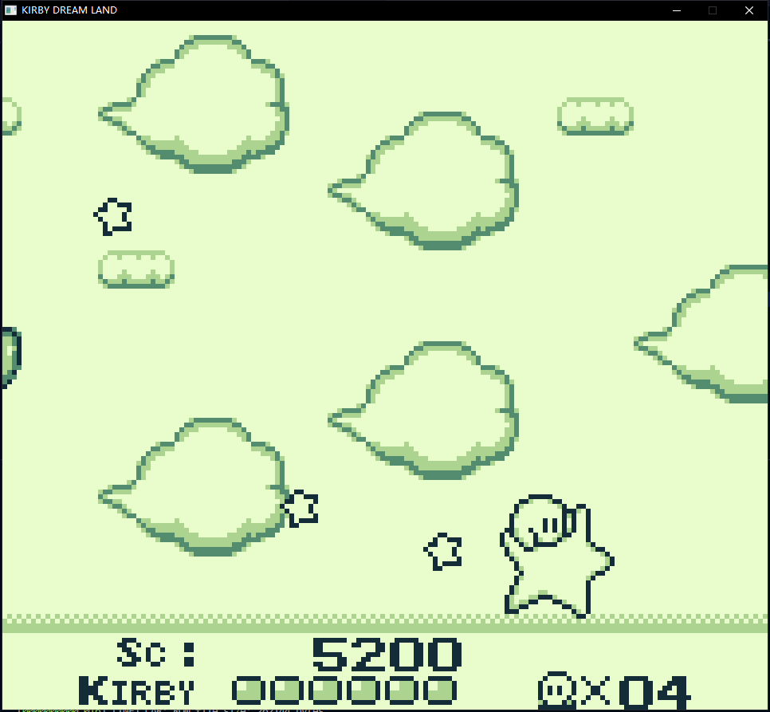
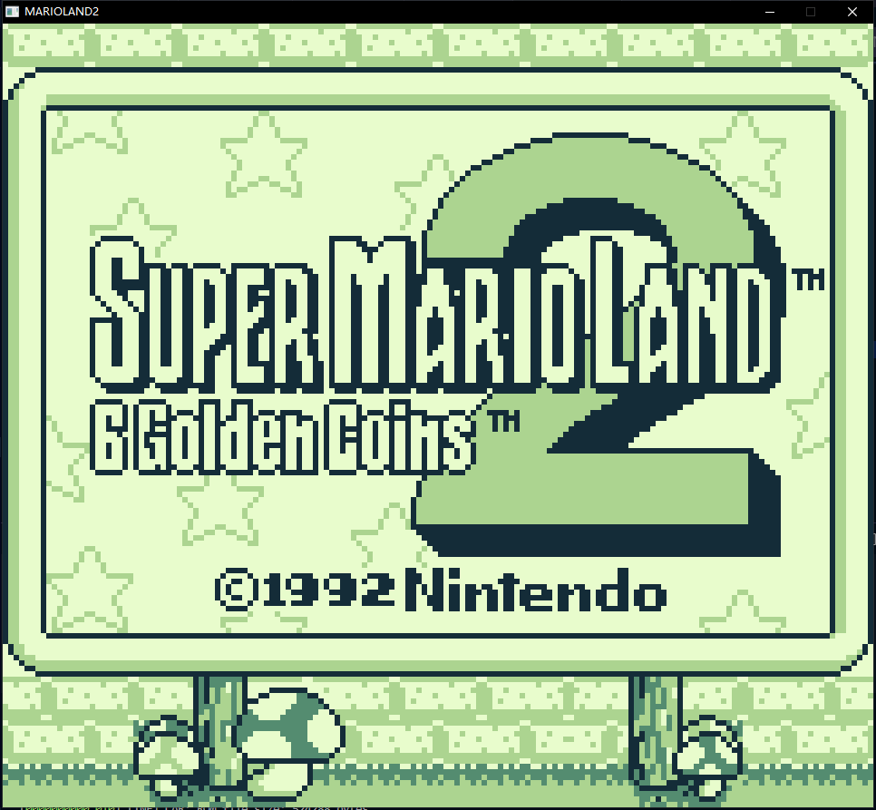

# gameboy-emulator
A pure C (C with class, if you may say) rework of https://github.com/xiongnemo/nekomimi-gameboy-emulator-1 (https://github.com/DarkKowalski/nekomimi-gameboy-emulator)

## Status

Full CPU Emulation is working.

MBC1 + ROM switching + RAM switching is working.

PPU is working.

Joypad is working.

RAM is working.

APU does not exist yet.

### Screenshots

#### CPU Instructions



#### The Legend of Zelda: Link's Awakening



#### Kirby's Dream Land (USA)



#### Super Mario Land 2 - 6 Golden Coins (USA) (Rev-B)



## Development

### Prerequisite

* gcc: Some macros is GNU extension.

```pwsh
nemo @ nemo-g15-5511 in ~\Documents\GitHub\gameboy-emulator on git:dev x [00:00:00]
$ gcc --version
gcc.exe (x86_64-posix-seh-rev0, Built by MinGW-Builds project) 15.1.0
Copyright (C) 2025 Free Software Foundation, Inc.
This is free software; see the source for copying conditions.  There is NO
warranty; not even for MERCHANTABILITY or FITNESS FOR A PARTICULAR PURPOSE.
```

* SDL3: You should have SDL3 installed or accessible in your system.
  
To use the provided Makefile, the folder structure (on Windows) should be as follows:
```
├─reference
│  └─...
├─SDL3
│  ├─bin
│  ├─include
│  │  └─SDL3
│  ├─lib
│  │  ├─cmake
│  │  │  └─SDL3
│  │  └─pkgconfig
│  └─share
│      └─licenses
│          └─SDL3
├─src
└─test
```

### Example configuration for VS Code

- Install C/C++ extension
- Setup SDL3 include path in `c_cpp_properties.json`

### Test

To mention, CPU test does not require SDL3.

#### All tests

```sh
make test > test.log 2>test.err.log
```

#### Run specific test

```sh
make <cpu|ram|cartridge>-test > test.log 2>test.err.log
```

### Run emulator

```sh
make
./dmg <rom_file>
```

#### Flags

```
Usage: ./dmg [options] <rom_file>
Options:
  -h, --help            Display this help message
  -d                    Enable debug output
  -v                    Verbose output (WARN, -v INFO, -vv DEBUG, -vvv TRACE, default: 0)
  -s, --scale <n>       Window scale factor (1-6, default: 2)
  -p, --serial          Enable serial output printing
Examples:
  ./dmg SuperMarioLand.gb
  ./dmg -d -vv zelda.gb
  ./dmg --serial cpu_instr.gb
```

#### Keys

```
W - Up
A - Left
S - Down
D - Right
J - A
K - B
LSHIFT - SELECT
ENTER - START
ESC - Quit
P - Print FPS (lifetime + this frame)
F1 - Screenshot (Default: gameboy_framebuffer.bmp)
LALT - Toggle joypad (enable/disable)
LCTRL - Fast forward
```